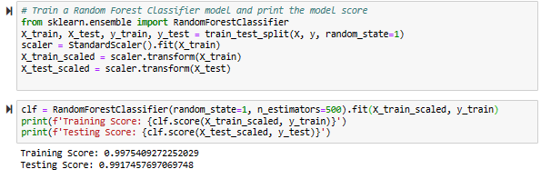

# supervised-machine-learning-challenge

## Overview 

In this repository, supervised machine learning was used to compare the Logistic Regression model and Random Forest Classifier modelin its ability to classify the risk level of given loans. Jupyter Notebook was used to train, test, compare, and fit these models. 

#### Prediction:
The Random Forests Classifier model will perform better because it is not easily affect by outliers or rely on the data being in a linear formation as logisitic regression models do. The Random Forests Classifier model uses averaging to make predictions for the model.

### Split the Data into Training and Testing Sets
The data was split into training and testing sets. The x value was determined by removing the 'loan_status' column. The y value was determined by using the 'loan_status' column. 

### Create, Fit, and Compare Models
First, a Logistic Regression model was created and fit to the training data in the above step. The model's score was determined by using the score function and the testing data from the above step. 

Second, a Random Forest Classifier model was created, fit, and scored using the training data above.

## Analysis 
The linear regression model performed better with a testing score of 0.9918489475856377 compared to the Random Forest Classifier testing score of 0.9917457697069748. The prediciton is wrong, the linear regression model may have performed better due to the dependence of loan status on other features within the dataset as opposed to Random Forest Classifier which has the ability to predict average scores better.  